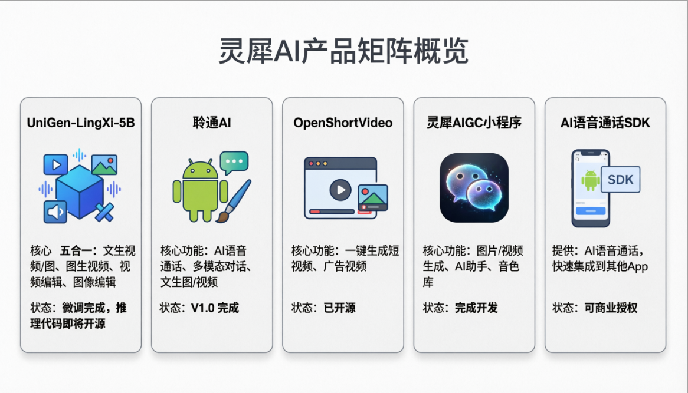

# 西安灵犀启航智能科技有限公司

  <strong>AIGC 全链路技术研发 · 端侧智能解决方案</strong>

  
  
  

---

## 关于我们

**西安灵犀启航智能科技有限公司**（Lingxi AI）成立于 2026 年 1 月，专注于 **AIGC 全链路技术研发**，涵盖图像/视频生成、端侧语音助手、AI 短视频平台及语音通话 SDK。我们致力于将前沿的生成式 AI 与端侧部署能力结合，为开发者与企业提供高效、可落地的智能解决方案。

- **核心业务**：AI 模型研发、端侧推理优化、开源生态建设

---

## 🚀 核心产品与开源项目

| 产品 | 功能 | 状态 |
|------|------|------|
| **UniGen-LingXi-5B** | 五合一视频/图像生成与编辑模型 | 微调完成，2026.05 开源 |
| **聆通 AI** | Android 端侧 AI 语音助手（VAD+ASR+LLM+TTS） | V1.0 已发布 |
| **OpenShortVideo** | AI 短视频生成平台 | [GitHub 开源](https://github.com/Shybert-AI/OpenShortVideo) |
| **灵犀 AIGC 小程序** | 图片/视频生成、AI 对话助手 | 12 万行代码，支付待集成 |
| **AI 语音通话 SDK** | 端到端 AI 语音通话能力，可快速集成 | 商业授权开放 |

> 所有产品均支持**端侧本地化部署**，注重隐私与低延迟。

---

## 🧠 核心技术

- **多模态生成**：五合一模型（文生图/视频、图生视频、视频编辑、指令编辑）独立微调，CFG 优化，效果显著
- **端侧语音全链路**：AEC、VAD、ASR、LLM、TTS 全本地运行，无需联网
- **全栈工程能力**：团队具备完整的 AI 产品从 0 到 1 的落地能力
---

## 📦 开源项目

欢迎关注与贡献：

- [**OpenShortVideo**](https://github.com/Shybert-AI/OpenShortVideo) – AI 短视频生成平台，支持文本/图片生成短视频
- [**AEC-Two-Stage-Based**](https://github.com/Shybert-AI/AEC-Two-Stage-Based) – 两阶段回声消除开源实现

> 2026 年 5 月将开源 **UniGen-LingXi-5B** 模型，并发布 arXiv 论文。

---

## 📞 联系方式

- **企业官网**：[https://app-91k4q9pod3pd.appmiaoda.com/](https://app-91k4q9pod3pd.appmiaoda.com/)
- **业务咨询**：可通过官网联系表单或 GitHub Issues 沟通

---

  <i>让 AI 触手可及 · 让智能无处不在</i>

